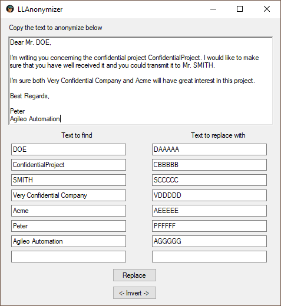

# LLAnonymizer
A simple application to anonymize text before using Large Language models (AI) on the cloud.

It uses a technic called [Pseudonymization](https://en.wikipedia.org/wiki/Pseudonymization) to replace sensitive text with placeholders without changing the overall structure of sentences so that AI can still "understand" them.

Sample screenshot:

Problem solved: Protecting customer data and your own intellectual property is a top priority. But how to harness the power of AI while maintaining data confidentiality?

**Benefit from AI without compromising confidentiality**.

If you're eager to leverage the power of AI platforms like DeepL, ChatGPT, MidJourney and others based on Large Language Models, LLAnonymzer bridges the gap between AI utilization and data privacy.

This ultra-simple application anonymizes the content you want, replacing sensitive information with wildcards and back. This means you can confidently use AI-powered tools without exposing sensitive information such as people's names, project names, companies, etc. ..... Don't worry anymore about sending sensitive data to the cloud.

Give LLAnonymizer a try and let us know if you find it useful! You can also contribute and update the application.

**Note:** if you don't want to compile the application, the executable is accessible here [LLAnonymizer/bin/Release/LLAnonymizer.exe](https://github.com/AgileoAutomation/LLAnonymizer/blob/main/LLAnonymizer/bin/Release/LLAnonymizer.exe)

You can find explanations how to use the application here: [LLAnonymzer-HowTo.pdf](https://github.com/AgileoAutomation/LLAnonymizer/blob/main/LLAnonymzer-HowTo.pdf)
